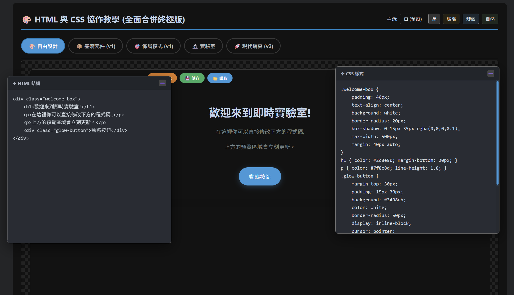
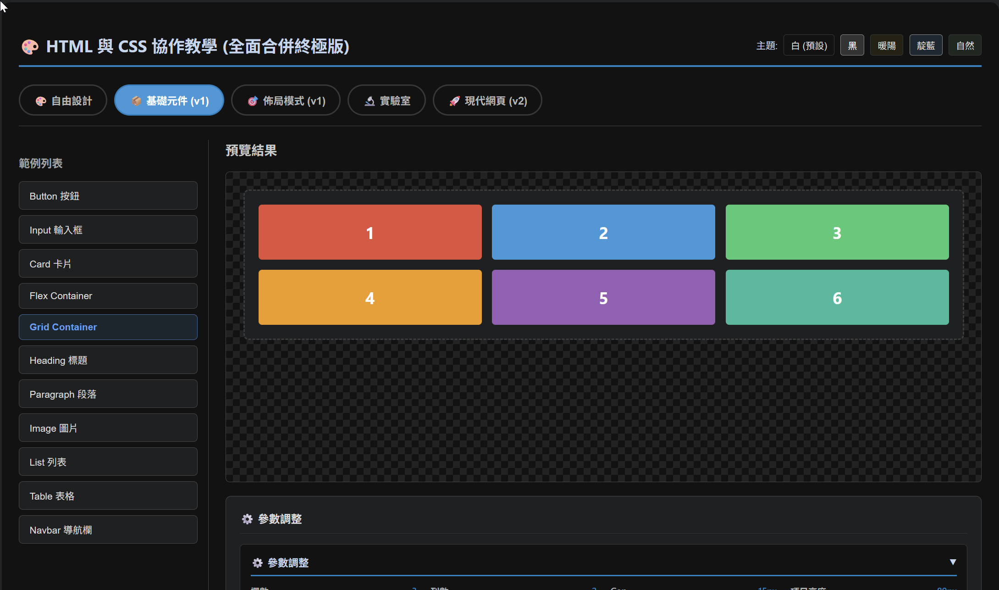
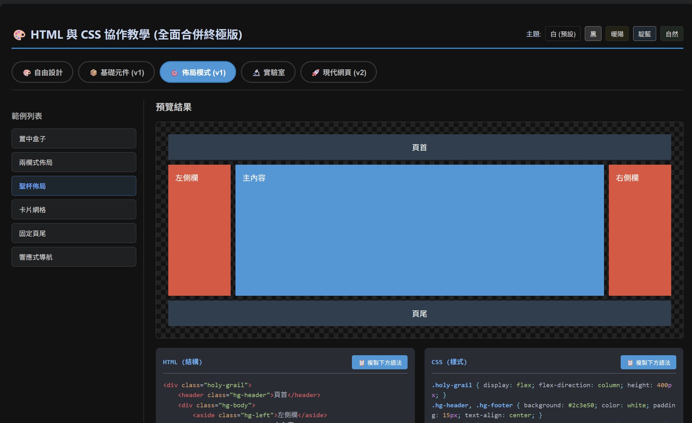
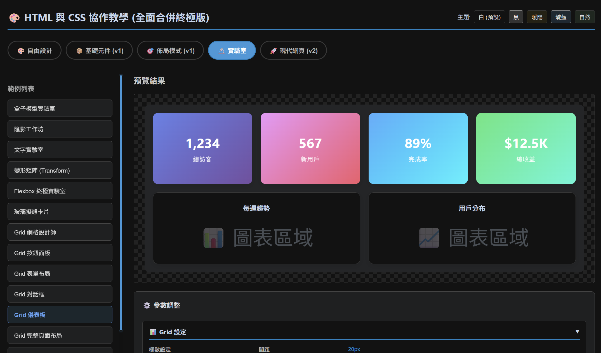

# HTML-CSS-LiveCanvas

### [LIVE DEMO HERE](https://lunarlunar.github.io/HTML-CSS-LiveCanvas/index.html)

**全方位前端教學與即時實驗平台 | Interactive HTML & CSS Learning Ecosystem**



## 📋 專案簡介 | Overview

**HTML-CSS-LiveCanvas** 是一款專為「網頁開發教學法 (Web Pedagogy)」設計的高效能互動沙盒系統。本專案核心目標在於打破傳統開發環境中代碼與渲染結果的時差感，透過即時渲染技術提供「所見即所得 (WYSIWYG)」的極致體驗。

系統不僅提供基礎代碼編輯功能，更內建了豐富的商業佈局模組與元件庫，並結合 SEO 語意化範本，協助教育者與初學者在理解技術細節的同時，也能掌握現代網頁設計的實務標準與搜尋引擎優化規範。

---

## 🌟 核心功能模組解析 | Key Functional Modules

### 1. 自由設計實驗室 (Live Playground)

*   **功能特點**：內建獨立的動態編輯視窗，支援 HTML 結構與 CSS 樣式的分離式操作。
*   **教學應用**：使用者可即刻觀察樣式屬性（如 `box-shadow`、`border-radius`）對 DOM 元素的即時影響，非常適合用於解釋盒模型（Box Model）與基礎排版邏輯。

### 2. 精選基礎元件庫 (Standard UI Components)

*   **功能特點**：提供標準元件示範，包含按鈕、輸入框、卡片以及基礎 Grid/Flex 容器。
*   **教學應用**：預設的 2x3 Grid 佈局展現了網格系統的靈活性。底部的「參數調教面板」可讓學生透過滑桿直觀地調整間距（Gap）與大小，將抽象的 CSS 單位具象化。

### 3. 經典佈局模式 (Classic Layout Templates)

*   **功能特點**：預載多種業界標準佈局，包括知名的「聖杯佈局 (Holy Grail Layout)」、響應式導覽與兩欄式架構。
*   **教學應用**：直接展示複雜的 `display: flex` 或 `display: grid` 結構。透過 HTML 與 CSS 的聯動對照，幫助學生快速掌握大結構佈局的組建技巧。

### 4. 進階儀表板實驗室 (Advanced UI Laboratory)

*   **功能特點**：模擬真實商業情境，如視覺化數據儀表板（Dashboard）。
*   **教學應用**：展示如何利用 CSS Grid 打造複雜的資訊卡片系統與數據圖表區域。此模組強調了 CSS 在處理動態內容排版時的強大能力。

---

## ✨ 核心價值 | Core Values

1.  **即時回饋 (Instant Feedback)**：消除編譯與重新整理的等待，提升學習心流（Flow）。
2.  **視覺化參數調控 (Parametric Logic)**：透過 GUI 面板直接控制 CSS 變數，輔助理解數值邏輯。
3.  **SEO 與語意化優先 (SEO-Centric)**：所有預設模板均遵循 HTML5 語意化規範，確保教學內容與業界接軌。
4.  **跨設備教學優化 (Responsive Pedagogy)**：內建多套主題顏色（如藍色、自然、深色），能適應不同的投影設備與光線環境。

---

## 🛠️ 技術組件 | Technology Stack

*   **核心引擎**: 原生 HTML5 / ES6+ JavaScript / CSS3 (Custom Variables)
*   **語法亮點**: Prism.js (提供專業開發環境般的代碼可讀性)
*   **架構設計**: 彈性浮動視窗系統 (Draggable Floating Layer)

---

## 🚀 快速啟動 | Getting Started

1.  **下載 / 克隆專案**:
    ```bash
    git clone https://github.com/YourUsername/HTML-CSS-LiveCanvas.git
    ```
2.  **本地執行**:
    直接使用任何現代瀏覽器開啟 `INEDX.html` 即可開始實驗。
3.  **線上部署**:
    完全相容於 Vercel 或 GitHub Pages，零配置即可發布教學網頁。

---

**HTML-CSS-LiveCanvas** —— 讓網頁教學變得更直觀、更專業、更具互動性。
